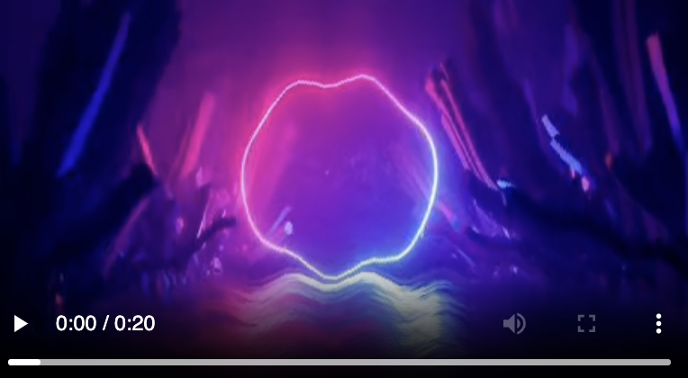

# Filter Video App Usage Guide

This document outlines how to use the Filter Video application and other related tools. This app applies filter over image to create a video.

## How to Run the App

To use the app, run the following command in your terminal:

```
python3 src/filter.py <type of filter> -i "<path to input image>" -o "<path to output video>" 
```

Where:
- `<type of filter>`: is type of filter you want to apply, list later. For each type, we have variaties of addictional params
- `-i <path to input image>`: is the path to the input image
- `-o <path to output video>`: is the path to the output video

### Example Usage

#### 1. Wave Distortion Filter
```
python3 src/filter.py <type of filter> -i "<path to input image>" -o "<path to output video>" -a <amplitude> -f <frequency> -l <length>
```

Where
- `<amplitude>`: is the amplitude of the wave, mean how much the wave will curve the image
- `<frequency>`: is the frequency of the wave, mean how long (in pixel) of a wave
- `<length>`: is the length of the output video, in second

```
python3 src/filter.py wave_distortion -i "demos/background/background.jpeg" -o "output/distorted_background.mp4" -a 5 -f 50 -l 20
```

#### Output 
<p align="center">
  
</p>