# Music Visualization App Usage Guide

This document outlines how to use the Music Visualization application and other related tools. This app creates visualizations of audio files in various forms.

## How to Run the App

To use the app, run the following command in your terminal:

```
python3 src/main.py -W <width> -H <height> -i <path_to_input> -o <path_to_output> -c <color_mode> -s <size> <wave_form_mode>
```

Where:

- `-W <width>`: width (in pixel) of the video
- `-H <height>`: height (in pixel) of the video
- `-i <path_to_input>`: Path to the input audio file.
- `-o <path_to_output_folder>`: Path to the output images folder.
- `-c <color_mode>`: Color mode for the visualization. Options include:
  - An hexadecimal color string (e.g., `"#FF0000"` for red).
  - `"gradient"` for a gradient color mode.
- `-s <size>`: Size of the visualization. The valid range for this value depends on the chosen waveform mode.
- `-f <flip>`: whether the output video flipped vertically recieve 1 or 0
- `-g <glow>`: Whether the output video has a glow effect. Receives 0 to 100 (0 disabled)
- `-t <token>`: token for authorization, UID|TOKEN
- `-u <url>`: url for authorization, STRING
- `<wave_form_mode>`: The mode of waveform visualization. Options include:
  - `"bars"`: Displays the audio spectrum as bars.
  - `"line"`: Displays the audio spectrum as a continuous line.
  - `"tiles"`: Displays the audio spectrum as tiles.
  - `"revert_tiles"`: Displays the audio spectrum as inverted tiles.
  - `"circular_bars"`: Displays the audio spectrum in a circular bars pattern around a central point.
  - `"tiles_with_cap"`: Displays the audio spectrum as tiles with a slow-drop cap
  - `"revert_tiles_with_cap"`: Displays the audio spectrum as inverted tiles with a slow-drop cap
  - `"signal"`: Displays the audio spectrum as signal
  - `"string"`: Displays the audio spectrum as string
- #### Optional Parameters for Circular Bars
  - For the `"circular_bars"` mode, you can use an optional parameter:
    - `--image_path <path_to_image>`: Path to an image file that will be displayed at the center of the circular bars.
- #### Require Parameters for tiles and revert tiles with cap
  - For the `"tiles_with_cap"` and `"revert_tiles_with_cap"`, you can use the parameter `--cap_color` to determin the color of the slow-drop cap. This param has the same value with param `-c`

### Example Usage

Here is an example of how you might call the app:
#### 1. Circular Bars
- `"-s"` (size) is positive integer, represent the bar width
```
python src/main.py -W 1920 -H 1280 -i "demos/input.mp3" -o "output/output_circular_bars" -c "gradient" -s 3 -g 30 -f 0 --to_video 1 -a 0 -t "315|aAyKUOBMXiw64bo9XarWu31y5MdRoPBMg0SwroA8" -u user.sscapi.co circular_bars --image_path "demos/sample.png"
```
#### Output 
<p align="center">
  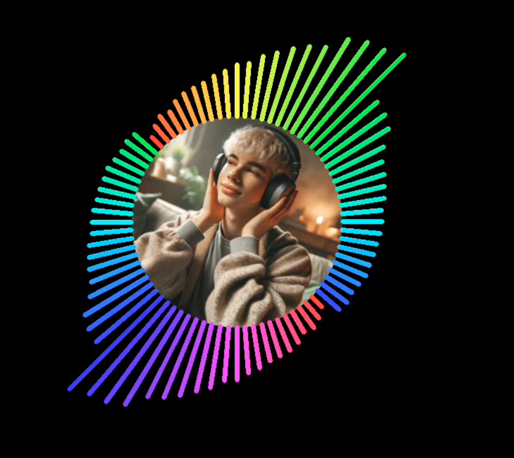
</p>

#### 2. Tiles
- `"-s"` (size) is positive integer, represent the tiles width
- `"--tile_height"` is positive integer, represent the tiles height option only for tiles related type
```
python src/main.py -W 1280 -H 720 -i "demos/input.mp3" -o "output/output_tiles" -c "gradient" -s 10 -g 30 -f 0 --to_video 1 -a 0 -t "315|aAyKUOBMXiw64bo9XarWu31y5MdRoPBMg0SwroA8" -u user.sscapi.co tiles --tile_height 10
```
#### Output
<p align="center">
  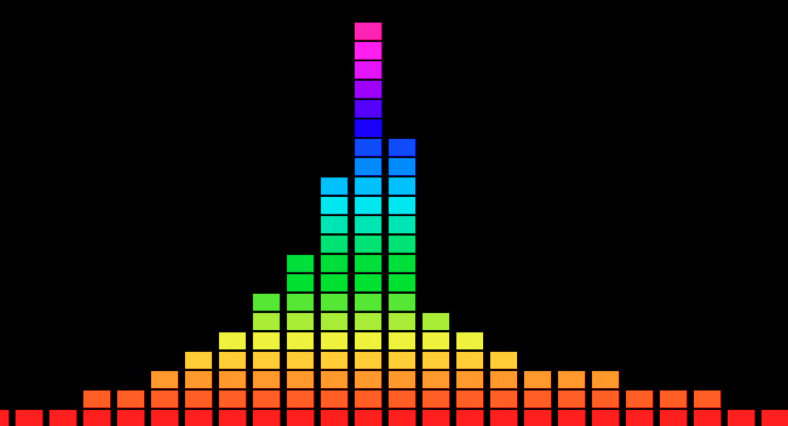
</p>

A variant of tiles is revert tiles, where the gradient color is filled upside down
```
python src/main.py -W 1280 -H 720 -i "demos/input.mp3" -o "output/output_revert_tiles" -c "gradient" -s 50 -g 30 -f 0 --to_video 1 -a 0 -t "315|aAyKUOBMXiw64bo9XarWu31y5MdRoPBMg0SwroA8" -u user.sscapi.co revert_tiles --tile_height 10 
```
#### Output
<p align="center">
  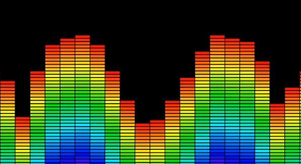
</p>

#### 3. Bars
- `"-s"` (size) is positive integer, represent the bar width
```
python src/main.py -W 1280 -H 720 -i "demos/input.mp3" -o "output/output_bars" -c "gradient" -s 10 -g 30 -f 0 --to_video 1 -a 0 -t "315|aAyKUOBMXiw64bo9XarWu31y5MdRoPBMg0SwroA8" -u user.sscapi.co bars
```
#### Output
<p align="center">
  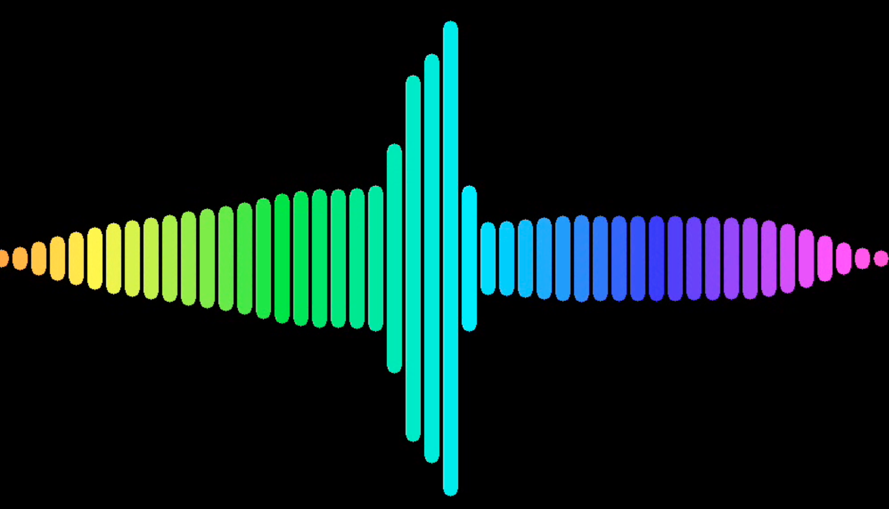
</p>

#### 4. Line
- `"-s"` Size of `"line"` represent the thickness of the line
```
python src/main.py -W 1280 -H 720 -i "demos/input.mp3" -o "output/output_line" -c "gradient" -s 5 -g 30 -f 0 --to_video 1 -a 0 -t "315|aAyKUOBMXiw64bo9XarWu31y5MdRoPBMg0SwroA8" -u user.sscapi.co line
```
#### Output
<p align="center">
  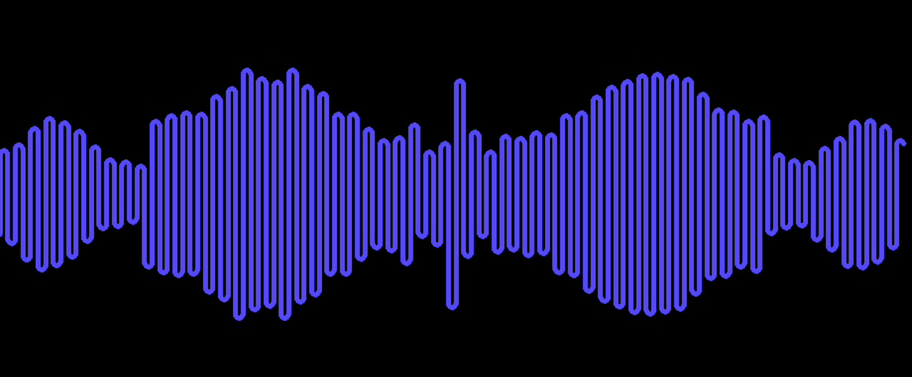
</p>

#### 5. Tile with cap
- `"-s"` (size) is positive integer, represent the tile width
- `"--tile_height"` is positive integer, represent the tiles height option only for tiles related type
```
python src/main.py -W 1280 -H 720 -i "demos/input.mp3" -o "output/output_tiles_with_cap" -c "gradient" -s 3 -g 30 -f 0 --to_video 1 -a 0 -t "315|aAyKUOBMXiw64bo9XarWu31y5MdRoPBMg0SwroA8" -u user.sscapi.co tiles_with_cap --cap_color "#ff00ff" --tile_height 10 
```

#### Output
<p align="center">
  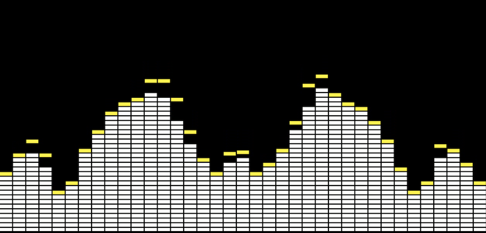
</p>

We also have the revert version of tiles with cap, the same with revert_tiles

```
python src/main.py -W 1280 -H 720 -i "demos/input.mp3" -o "output/output_rever_tiles_with_cap" -c "gradient" -s 3 -g 30 -f 0 --to_video 1 -a 0 -t "315|aAyKUOBMXiw64bo9XarWu31y5MdRoPBMg0SwroA8" -u user.sscapi.co revert_tiles_with_cap --cap_color "#ffffff" --tile_height 10
```

#### Output
<p align="center">
  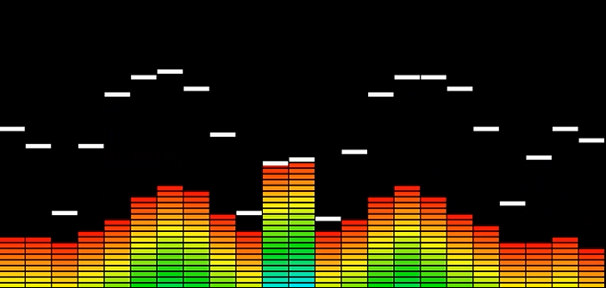
</p>

#### 6. Signal
- `"-s"` (size) represent the thickness of the line
```
python src/main.py -W 1280 -H 720 -i "demos/input.mp3" -o "output/output_signal" -c "gradient" -s 2 -g 30 -f 0 --to_video 1 -a 0 -t "315|aAyKUOBMXiw64bo9XarWu31y5MdRoPBMg0SwroA8" -u user.sscapi.co signal
```
#### Output
<p align="center">
  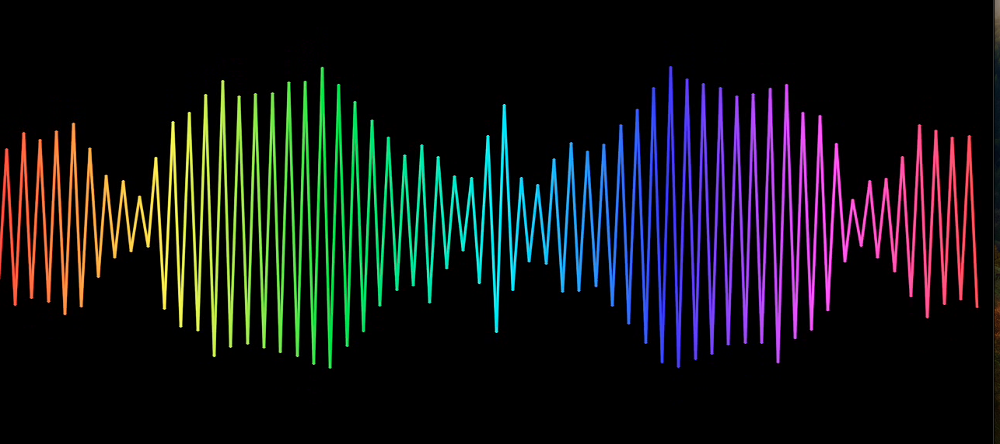
</p>

#### 7. String
- `"-s"` (size) represent the thickness of the string
```
python src/main.py -W 1280 -H 720 -i "demos/input.mp3" -o "output/output_string" -c "gradient" -s 2 -g 60 -f 0 --to_video 1 -a 0 -t "315|aAyKUOBMXiw64bo9XarWu31y5MdRoPBMg0SwroA8" -u user.sscapi.co string
```
#### Output
<p align="center">
  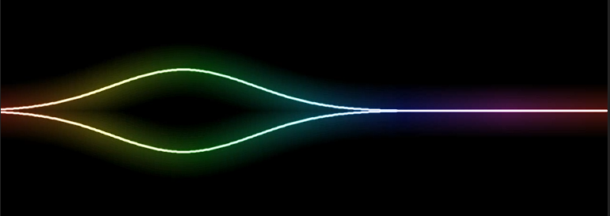
</p>

#### 8. Oval
- `"-s"` (size) is positive integer, represent the oval width
```
python src/main.py -W 1280 -H 720 -i "demos/input.mp3" -o "output/output_oval" -c "gradient" -s 20 -g 30 -f 0 --to_video 1 -a 0 -t "315|aAyKUOBMXiw64bo9XarWu31y5MdRoPBMg0SwroA8" -u user.sscapi.co oval
```
#### Output
<p align="center">
  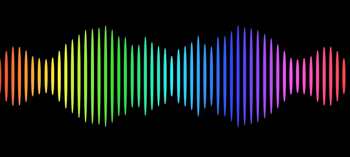
</p>

#### 9. Up Bars
- `"-s"` (size) is positive integer, represent the bar width
```
python src/main.py -W 1280 -H 720 -i "demos/input.mp3" -o "output/output_up_bars" -c "gradient" -s 10 -g 30 -f 1 -t "315|aAyKUOBMXiw64bo9XarWu31y5MdRoPBMg0SwroA8" -u user.sscapi.co up_bars
```
#### Output
<p align="center">
  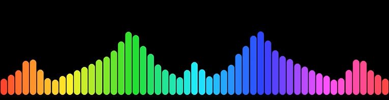
</p>

#### 10. Liquid
```
python src/main.py -W 1280 -H 720 -i "demos/input.mp3" -o "output/output_liquid" -c "gradient" -s 1 -g 30 -f 0 --to_video 1 -a 0 -t "315|aAyKUOBMXiw64bo9XarWu31y5MdRoPBMg0SwroA8" -u user.sscapi.co liquid
```
#### Output
<p align="center">
  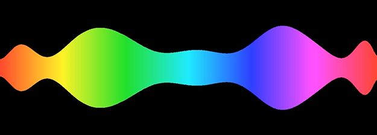
</p>

#### 10. Circula Liquid
```
python src/main.py -W 1280 -H 720 -i "demos/input1.mp3" -o "output/output_circular_liquid" -c "gradient" -s 10 -g 30 -f 0 --to_video 1 -a 0 -t "315|aAyKUOBMXiw64bo9XarWu31y5MdRoPBMg0SwroA8" -u user.sscapi.co circular_liquid --image_path "demos/tungla.jpg"
```
#### Output
<p align="center">
  
</p>

#### 11. Circula Signal
```
python src/main.py -W 1280 -H 720 -i "demos/input.mp3" -o "output/output_circular_signal" -c "gradient" -s 2 -g 30 -f 0 --to_video 1 -a 0 -t "315|aAyKUOBMXiw64bo9XarWu31y5MdRoPBMg0SwroA8" -u user.sscapi.co circular_signal
```
#### Output
<p align="center">
  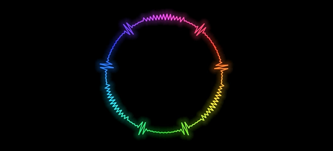
</p>

#### 12. Image
- `"--fit"` is the option to fit the image, option is "origin", "fit", an integer value or a combination of for value (x, y, w, h) separated by comma (for e.g "100, 100, 500, 500" to set the image to fit the frame with the top-left corner at (100, 100) and the size of 500x500 px)
- `"--mode"` is the option to set whether the image zoom base on bass or treble, option is "bass" or "treble"
- `"--background"` is path to the background image or video (should not be longer t)
- `"--scale"` is the max scale (in percentage) of the image, corresponding to the maximum value of the audio spectrum
```
python src/main.py -W 1280 -H 720 -i "demos/input.mp3" -o "output/output_image" -c "gradient" -s 2 -g 45 -f 0 --to_video 1 -a 0 -a 0 -t "315|aAyKUOBMXiw64bo9XarWu31y5MdRoPBMg0SwroA8" -u user.sscapi.co image --image_path "demos/sample.png" --fit "origin" --mode "treble" --background "demos/background/background1.mp4" --scale 100
```
#### Output
<p align="center">
  
</p>

#### 14. Double Liquid
```
python src/main.py -W 1280 -H 720 -i "demos/input.mp3" -o "output/output_double_liquid" -c "#0000fd" -s 1 -g 30 -f 0 --to_video 1 -a 0 -t "315|aAyKUOBMXiw64bo9XarWu31y5MdRoPBMg0SwroA8" -u user.sscapi.co double_liquid
```
#### Output
<p align="center">
  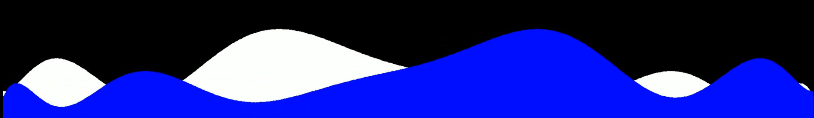
</p>

#### 15. Symmetric Bars
```
python src/main.py -W 1920 -H 1080 -i "demos/thanhti.mp3" -o "output/output_symmetric_bars" -c "gradient" -s 5 -g 0 -f 0 --to_video 1 -a 0 -t "315|aAyKUOBMXiw64bo9XarWu31y5MdRoPBMg0SwroA8" -u user.sscapi.co symmetric_bars --image_path "demos/sample.png" --bar_height 10
```
#### Output
<p align="center">
  
</p>

*Note that if you are using Windows, you need to install ffmpeg manually (you may need this [instruction](https://www.geeksforgeeks.org/how-to-install-ffmpeg-on-windows/)) and add the ffmpeg folder to the PATH. We recommend using Command Line to execute the script instead of PowerShell.*

#### 3. Disk Bars
- `"-s"` (size) is positive integer, represent the bar width
- `"--disk_size"` is positive integer, represent the disk size in pixel
- `"--disk_path"` is the path to the disk image
```
python src/main.py -W 1280 -H 720 -i "demos/input.mp3" -o "output/disk_bars" -c "#ffffff" -s 10 -g 0 -f 0 --to_video 1 -a 0 -t "315|aAyKUOBMXiw64bo9XarWu31y5MdRoPBMg0SwroA8" -u user.sscapi.co disk_bars --disk_size 100 --disk_path "demos/disk.png"
```
#### Output
<p align="center">
  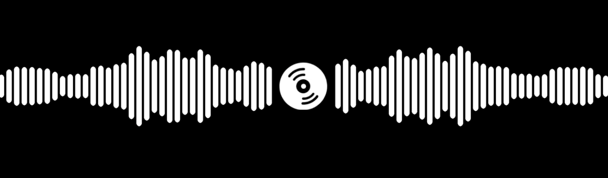
</p>

# Subtitle Merge Tool Usage Guide

## How to Run the Tool
```
python src/srt_merge.py -i <path_to_input_folder> -o <path_to_output_file>
```

Where:
- `-i <path_to_input_folder>`: Path to the input folder containing the subtitle files. Srt files in this folder must be named in the format `<index>.srt`.
- `-o <path_to_output_file>`: Path to the output file where the merged subtitle will be saved.


### Example Usage
```
python src/srt_merge.py -f "demos/subscript" -o "output/merged.srt"
```